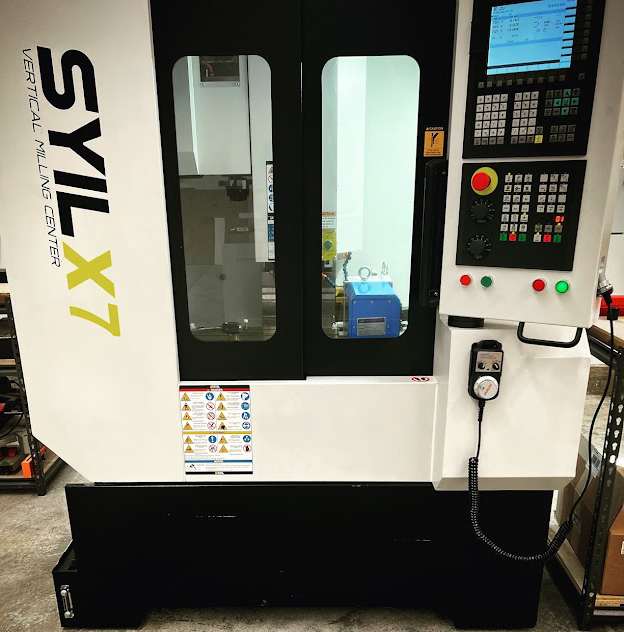

# Syil (2022) x7 Commissioning

## Commissioning

### [Preparations](preparations.md)

- Site Preparations
- Required Tools
- Parts To Order Before Delivery

### [Machine Delivery](machine_delivery.md)

- Uncrating
  - Unbox Unwrap
  - Remove Skid
- Moving
  - Forklifts
  - Pallet Jacks
- Placement Considerations
- Leveling
- Final Assembly
  - Remove Braces
  - Attache Cavers
  - Check For Anything Loose
- Remove Rust Inhibitor
- Machine status Lamp
- Remove forklift Shelve

### [Machine Connections](machine_connections.md)

- 3 Phase Power
  - US Transformer
  - Wiring
- Air
- Ways Lubricant
- Coolant Pump
- Wash Down Hose
- Air Blast Hose
- Hand Jog Control
- Cat5 6 Network

### First Power On

From here on details are separated by control to simplify setup based on the control on your specific machine.

- [LNC](lnc.md)
- [Siemens](siemens.md)
- [Syntec](syntec.md)

---

## [Fixtures](fixtures.md)

- Bed Vice
- 4th Axis

## [Tooling](tooling.md)

- Size restrictions
  - Arm Tool Change
  - Umbrella Toolchanger
  - BT30 limits
- BT30 Tools sources
  - ( list of sites )

---

# [APPENDIX](appendix.md)

## Wire Diagrams

## Mechanical Drawings
