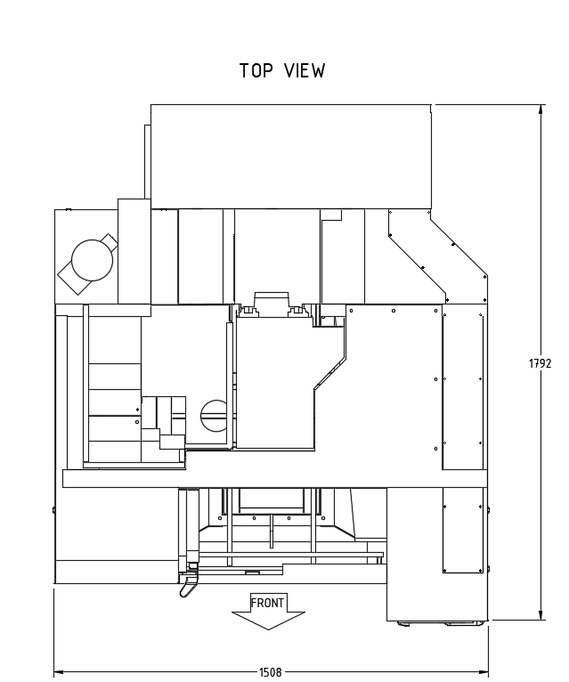
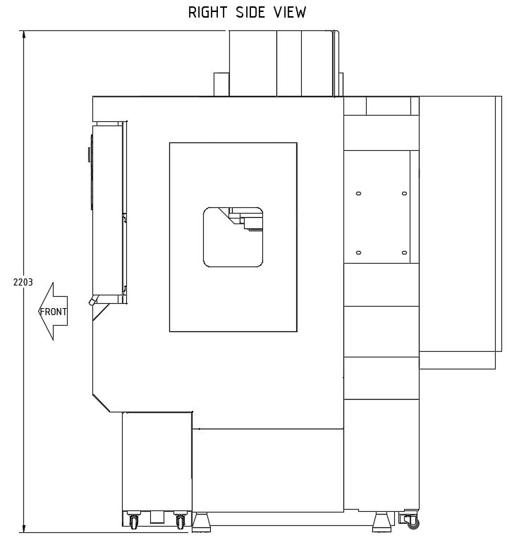

# Preparations

## Machine Details

**Machine weight:**
1500kg | 3306lbs

**Shipping weight ( in crate box ):**
2040kg | 4497lbs

**Machine Dimensions**
 

**Crate Dimensions**

## Site Preparations

Slab requirements [TODO]

## Required Tools

Syil ships machines with a basic set of open ended wrenches and allen wrenches. These are convenient but only minimum quality. IF you have your own tools you can collect a few additional items to ease machine commissioning

- 1 21mm socket and driver with a reasonable length handle. This will make leveling the machine feet easier.

- 1 Precision/MMachinists level| This ensures you can accurately level the machine. You could use a carpentry level if it is in very good condition.

- 1 Forklift|Required to lift machine from shipping pallet. Forklift/pallet jack rated for machine weight to move machine into position.

- 1 can WD40 or similar solvent. Used to remove rust inhibitor. Also shop rags/paper towels to remove rust inhibitor.

## Parts to Order Before Delivery

You can always order these items after delivery but in all likelihood you will want to get the machine connected as quickly as possible. If you arrange for a licensed electrician to connect your machine this list will help ensure they have an idea of what is required to connect the machine to power.

If you intended on connect the machine yourself this list also provides a good start on what you will need. Depending on where you live these items may not be easily available and you may to need to have them shipped to you. Lead times can be long and delay powering your machine up.

At a minimum you need to have materials to connect your Syil to power. US machines include a 240v to 380-400v transformer. **The Syil does not come with power cables from your 3 Phase power source to the Transformer and from the Transformer to the CNC MAchine.**

You must connect you machine with cable rated for the voltage and current required. Considering a 30 amp draw is most likely the largest your X7 will draw, 10 AWG is the minimum wire gauge one should use to connect to the power source. 8 AWG conductors provide some additional current draw capacity at the cost of additional expense in cable and parts. There is little reason to use anything larger than 6 AWG. Cables will need to be 4 conductor rubber-cased and suitable for power cables typical for an RV/Camper or generator.

Note, if using 6 AWG you will will find crimping connectors more difficult to find. You msy need need battery terminals and special crimping tools. These increase expense considerably. Most of the CNC's electronics cabinet's entry and exit ports are not sized for cable glands to fit 4-6 Cable and you will need to drill them out to 32mm | 1.25in diameter.

For example purposes the parts list below assumes 8 AWG. Adapt to your chosen gauge.

**You will require:**

- 1 Cable from 3 Phase source to Transformer

- 1 Cable from transformer to CNC Machine. If you locate the transformer under the right side of yor mill ( which is where it is usually shown on the x7 promotional materials ) you need about 1.25m or 4ft of cable to reach the CNC cabinet.

- 16 Ferule, spade, or terminal rings for chosen AWG conductors to connect cables to terminal blocks.

- 2 90 degree cable glands to protect cables as they enter and exit the bottom of the transformer

- Wire cutters and Crimping tool for chosen cable connectors

**Optionally you may want**

- 2 cable connector pairs suitable for chosen AWG and 30 Amps to allow you to disconnect the transformer from source and the machine from transformer.

- 200mm to 300mm | 8 to 12in Heatshrink for added terminal connector protection

- 1 Step drill bit up to 1 3/8in if using 6 AWG conductor
